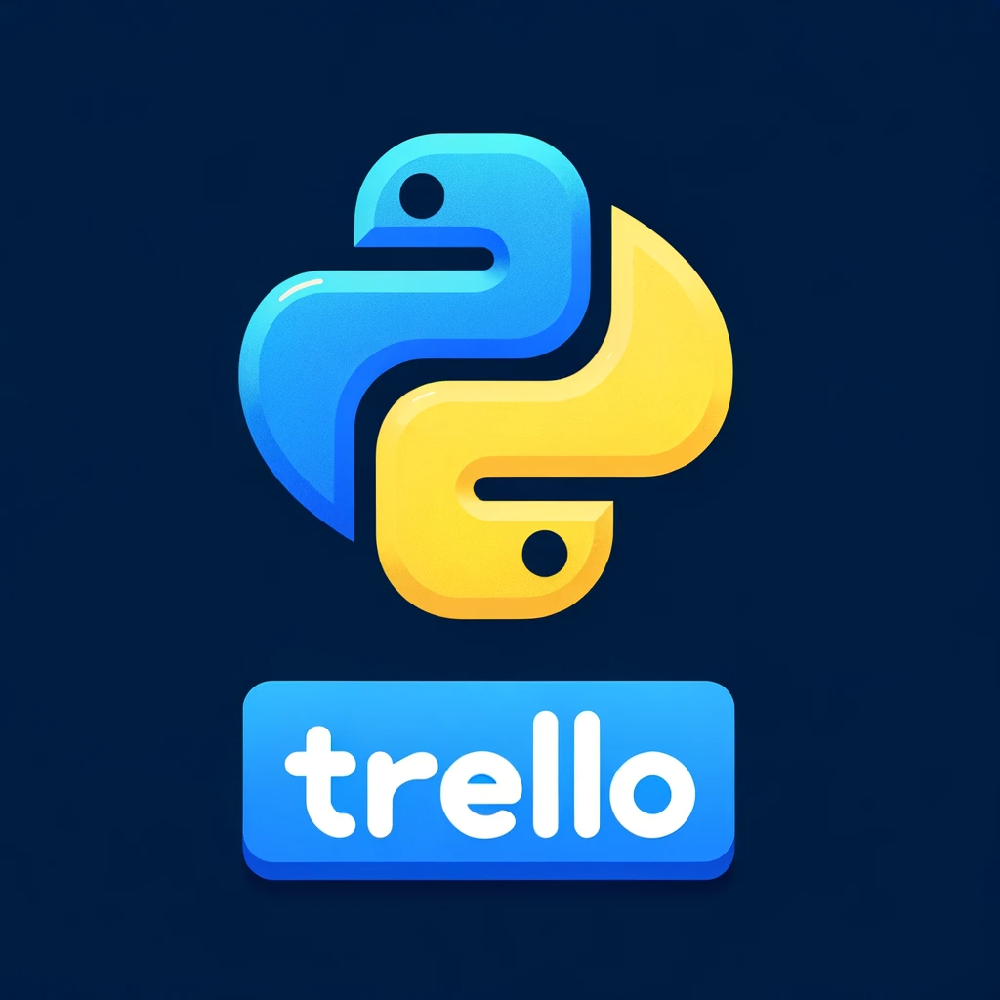

# pytrello2



[](https://github.com/5-jigglypuff/pytrello2/actions/workflows/ci-python.yml) 
[](https://coveralls.io/github/5-jigglypuff/pytrello2?branch=master) 
[](https://badge.fury.io/py/pytrello2)

> Python wrapper for the Trello API

`pytrello2` is a Python wrapper and ORM that provides an easy way to interact with the Trello API. It handles authentication, mapping Python objects to Trello JSON, and provides a clean interface for all API endpoints.

## Getting started

1. Clone your new repository to your local machine.
    ```bash
    git clone https://github.com/5-jigglypuff/pytrello2
    ```
2. Install the required dependencies using Poetry.
    ```bash
    poetry install
    ```
3. Activate the virtual environment using Poetry.
    ```bash
    poetry shell
    ```
4. Run static analysis using flake8.
    ```bash
    flake8
    ```
5. Run code formatting using black.
    ```bash
    black .
    ```
6. Run tests using pytest.
    ```bash
    pytest
    ```

## License

This project is licensed under the MIT License - see the [LICENSE](./LICENSE) file for details.
